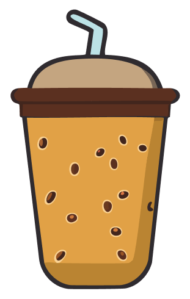
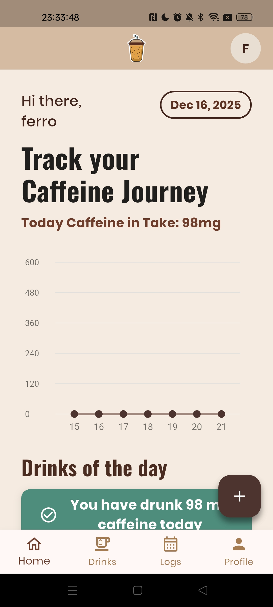
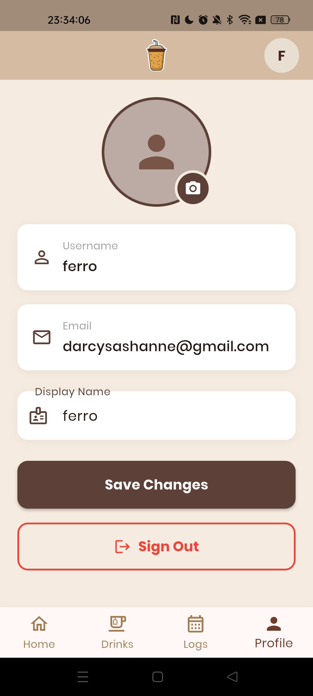

<div align="center">

# ☕ Caffeine Tracker



**Your Personal Caffeine Management App**  
*Track, Monitor, and Manage Your Daily Caffeine Intake*

[](https://github.com/FathurrahmanNasution/caffeine_tracker/releases)

[📥 Download](https://github.com/FathurrahmanNasution/caffeine_tracker/releases)

</div>

---

## 👤 Personal Identity

<div align="center">

|          **Nama**          |  **NIM**  | **Lab** |
|----------------------------|-----------|---------|
| Clarissa Halim             | 231401020 |   Lab 3 |
| Ferarine                   | 231401095 |   Lab 4 |
| Fathurrahman Nasution      | 231401110 |   Lab 4 |

**Universitas Sumatera Utara**  
**Mata Kuliah:** Pemrograman Mobile  
**Asisten Lab:** Rivaldo Dominggos Pardede, Frederick Godiva

</div>

---

## ✨ What is Caffeine Tracker?

**Caffeine Tracker** is a modern mobile application built with Flutter that helps you monitor and manage your daily caffeine consumption. With seamless Firebase integration, track your coffee, tea, energy drinks, and other caffeinated beverages with real-time synchronization across devices.

Think of it as your **personal caffeine journal** in your pocket—always accessible, beautifully designed, and packed with insightful analytics.

---

## 📱 Screenshots

<div align="center">
  
  
  
  
  
  
</div>

*Track your drinks, view weekly analytics, explore coffee database, and customize your profile—all with a beautiful brown-themed interface.*

---

## 🎥 Demo Aplikasi

<div align="center"> 

🔗 [Your Drive Link Here]

</div>

---

## 📥 Installation

### **Download from GitHub Releases**

1. **Visit** the [Releases page](https://github.com/FathurrahmanNasution/caffeine_tracker/releases)

2. **Download** the latest APK:
    - `app-release.apk` (recommended)

3. **Enable Unknown Sources** (if first time installing APK):
    - Go to **Settings** → **Security**
    - Enable **Install from Unknown Sources**
    - Or on Android 8+: Allow installation from browser

4. **Install** the APK:
    - Open the downloaded file
    - Tap **Install**
    - Wait for installation to complete

5. **Launch** Caffeine Tracker:
    - Tap **Open** after installation
    - Or find the app icon in your app drawer

6. **Done!** Start tracking your caffeine intake 🎉

> 💡 **Note**: All releases are hosted on [GitHub Releases](https://github.com/FathurrahmanNasution/caffeine_tracker/releases). Always download from official sources to ensure security.

---

## 🎯 Quick Start Guide

### **First Launch**
1. After installation, open the **Caffeine Tracker** app
2. **Create an account** or **Login** with existing credentials
3. Grant necessary permissions when prompted
4. Start logging your caffeine consumption!

### **Common Tasks**

#### ☕ **Log Your Drinks**
1. Tap the **+ button** on the Dashboard
2. Browse the **Coffee List** or search for specific drinks
3. Select a drink and customize serving size if needed
4. Tap **Add** to log the consumption
5. View your updated daily caffeine intake instantly

#### 📊 **View Analytics**
1. Navigate to **Logs** tab from bottom navigation
2. View your consumption by:
   - **Weekly**: See daily caffeine intake for the current week
   - **Monthly**: Analyze weekly totals for the selected month
   - **Yearly**: Track monthly trends throughout the year
3. Tap on any data point to see detailed breakdown
4. Use filters to explore different time periods

#### 📚 **Browse Coffee Database**
1. Navigate to **Add Drinks** tab
2. Explore various categories:
   - Hot Coffee
   - Iced Coffee
   - Tea
   - Energy Drinks
   - And more!
3. Search for specific drinks using the search bar
4. View detailed caffeine content and serving sizes

#### 👤 **Manage Profile**
1. Navigate to **Profile** tab
2. Update your display name, username, or avatar
3. Change your password for security
4. View your caffeine consumption statistics
5. Logout when needed

---

## 🌟 Key Features

### **Dashboard**
- 📈 Real-time caffeine intake visualization
- 📅 Weekly consumption chart with interactive data points
- ☕ Quick access to today's logged drinks
- 🎯 Daily caffeine goal tracking
- ➕ Floating action button for quick drink logging

### **Logs & Analytics**
- 📊 Three-view analytics: Weekly, Monthly, Yearly
- 🔍 Interactive charts with tap-to-detail functionality
- 📆 Calendar view for specific date selection
- 📝 Comprehensive consumption history
- 🗑️ Easy drink deletion with confirmation
- 🎨 Color-coded visualization for better insights

### **Coffee Database**
- 🔎 Searchable drink catalog
- 📋 Categorized beverage lists
- ℹ️ Detailed caffeine content information
- 📏 Customizable serving sizes
- 🆕 Regular database updates

### **User Profile**
- 👤 Customizable profile with avatar upload
- 🔐 Secure password management
- 📊 Personal consumption statistics
- ⚙️ Account settings and preferences
- 🚪 Secure logout functionality

### **Authentication**
- 🔒 Secure Firebase Authentication
- 📧 Email & password login
- ✨ Beautiful onboarding experience
- 🔑 Password reset functionality
- 👥 Multi-device synchronization

---

## 🏗️ Tech Stack

<div align="center">

| Category | Technology |
|----------|-----------|
| **Framework** | Flutter 3.35.3 |
| **Language** | Dart 3.9.2 |
| **Backend** | Firebase (Firestore, Auth, Storage) |
| **Database** | Cloud Firestore |
| **Authentication** | Firebase Auth |
| **Storage** | Firebase Storage |
| **Architecture** | Clean Architecture |
| **State Management** | Provider / setState |
| **Build Tools** | Gradle, Android SDK |

</div>

---

## 📂 Project Structure

```
caffeine_tracker/
├── lib/
│   ├── model/              # Data models
│   │   ├── user_model.dart
│   │   ├── consumption_log.dart
│   │   └── drink_model.dart
│   ├── pages/              # Screen pages
│   │   ├── dashboard_page.dart
│   │   ├── tracker_page.dart
│   │   ├── coffee_list_page.dart
│   │   └── profile_page.dart
│   ├── services/           # Business logic
│   │   ├── auth_service.dart
│   │   ├── consumption_service.dart
│   │   └── drink_service.dart
│   ├── widgets/            # Reusable components
│   │   ├── caffeine_chart.dart
│   │   ├── consumption_log_card.dart
│   │   └── app_bottom_navigation.dart
│   └── main.dart           # Entry point
├── assets/
│   ├── images/
│   └── fonts/
└── pubspec.yaml
```

---

## 🔥 Firebase Configuration

### **Collections Structure**

#### **users**
```json
{
  "userId": "string",
  "username": "string",
  "displayName": "string",
  "email": "string",
  "profilePicture": "string (URL)",
  "createdAt": "timestamp"
}
```

#### **drinks**
```json
{
  "drinkId": "string",
  "name": "string",
  "category": "string",
  "caffeineContent": "number (mg per 100ml)",
  "defaultServingSize": "number (ml)",
  "description": "string",
  "imageUrl": "string"
}
```

#### **consumptions**
```json
{
  "consumptionId": "string",
  "userId": "string",
  "drinkId": "string",
  "drinkName": "string",
  "servingSize": "number (ml)",
  "caffeineContent": "number (mg)",
  "consumedAt": "timestamp (ISO 8601)"
}
```

---

## 🎨 Design Features

- 🎨 **Brown Color Theme**: Warm, coffee-inspired color palette
- 📱 **Responsive Design**: Optimized for various screen sizes
- 🌙 **Consistent UI**: Unified design language across all screens
- ✨ **Smooth Animations**: Fluid transitions and interactions
- 📊 **Custom Charts**: Interactive data visualization
- 🎯 **Intuitive Navigation**: Easy-to-use bottom navigation

---

## 🚀 Future Enhancements

- [ ] Dark mode support
- [ ] Push notifications for caffeine limit warnings
- [ ] Social features (share achievements)
- [ ] Advanced analytics (sleep impact tracking)
- [ ] Custom drink creation
- [ ] Export data to CSV/PDF
- [ ] Multi-language support
- [ ] Caffeine calculator for custom drinks
- [ ] Integration with health apps
- [ ] Widget for home screen

---

## 🙏 Acknowledgments

- **Bang Paldo dan Bang Frederick** - For the guidance and mentorship throughout the semester
- **Lab 3 and Lab 4 Classmates** - For continuous support and collaboration
- **IKLC Team** - For providing excellent learning materials and comprehensive teaching modules
- **Coffee Lovers Community** - For inspiration and feedback

---

## 📞 Contact & Links

<div align="center">

[](https://github.com/FathurrahmanNasution)
[](mailto:your.email@students.usu.ac.id)

</div>

---

## 📄 License

This project is created for educational purposes as part of the Mobile Programming course at Universitas Sumatera Utara.

---

<div align="center">

_Empowering mindful caffeine consumption, one cup at a time_

⭐ **Star this repo** if you find it useful!

Made with ☕ and ❤️

</div>
